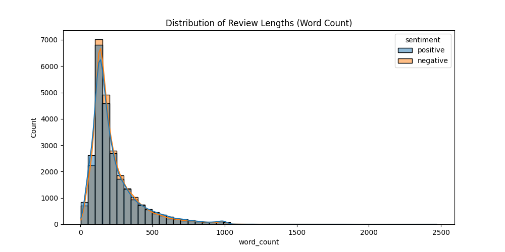
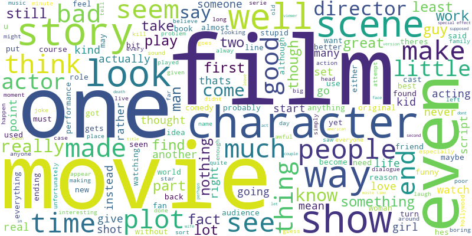
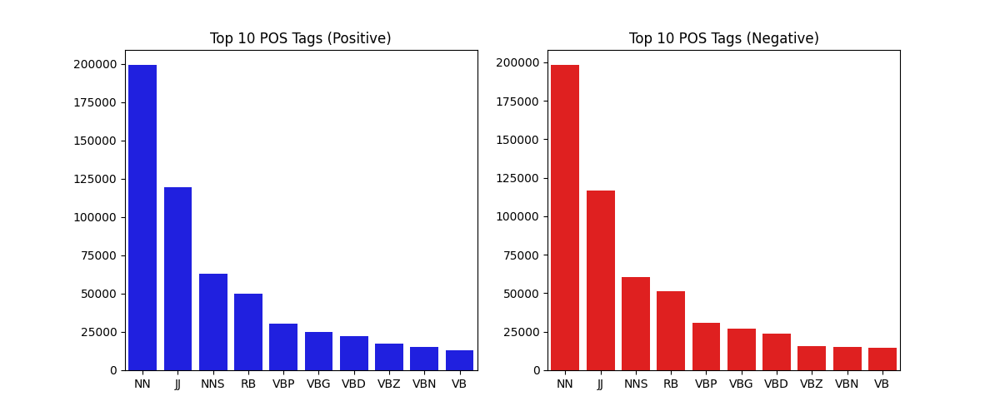
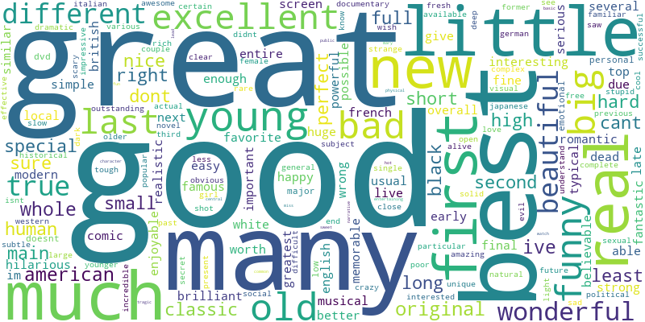
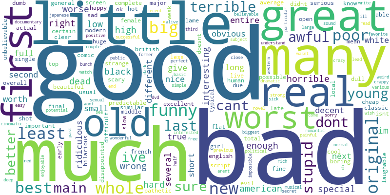

# Task 1: Data Exploration and Insights Report

## Overview
This report summarizes the analysis of the `IMDB Dataset.csv`, consisting of 50,000 movie reviews labelled as positive or negative.

## Key Findings

1.  **Balanced Classes**: The dataset is perfectly balanced with 25,000 positive and 25,000 negative reviews. No class imbalance handling is needed.
2.  **Length Similarity**: Both classes have remarkably similar text lengths.
    *   **Positive**: Mean ~233 words, Median 172 words.
    *   **Negative**: Mean ~229 words, Median 174 words.
    *   *Insight*: Length is likely not a strong discriminator for sentiment in this dataset.
3.  **Preprocessing Needs**:
    *   The Bigram analysis revealed that `br br` is the most common bigram (approx. 10k occurrences in sample). This indicates that HTML line breaks (`  `) are prevalent and need specific cleaning, as standard regex removal of `<.*?>` might have missed cases or they are encoded differently.
    *   "Mixed" vocabulary: Words like "good" appear frequently in negative reviews (14,150 times), suggesting a high prevalence of negation (e.g., "not good").

## Detailed Analysis

### 1. Class Distribution
The dataset is split 50/50.

### 2. Text Length
The distribution of word counts is right-skewed, with most reviews under 400 words but some extending much longer. The distributions for positive and negative reviews overlap almost perfectly.

### 3. Word Clouds
#### Positive Reviews
Prominent words: *film, movie, one, great, good, love, best, story*.

#### Negative Reviews
Prominent words: *movie, film, one, bad, even, like, good, dont, waste*.

### 4. N-gram Analysis (Top Bigrams)
Based on a sample subset:
*   **Artifacts**: `br br`, `br film`, `br movie` are dominant, highlighting HTML noise.
*   **Positive Bigrams**: `special effects`, `new york`, `10 10`, `don know`.
*   **Negative Bigrams**: `low budget`, `waste time`, `special effects` (likely used critically).

### 5. Part-of-Speech (POS) Tagging
*   **Distribution**: Nouns and Verbs dominate the text, as expected in narrative descriptions (~25% Nouns, ~20% Verbs). Adjectives make up a significant portion (~15%), carrying much of the sentiment.
*   **Balance**: The distribution of POS tags is nearly identical between positive and negative reviews, implying that sentiment isn't driven by "more emotional" (more adjectival) writing, but by *which* adjectives are used.

### 6. Adjective Analysis
Isolating adjectives reveals a critical challenge for sentiment analysis: **Ambiguity and Negation**.

*   **Positive Adjectives**: *good, great, many, best, little*.
    
*   **Negative Adjectives**: *good, bad, much, little, many*.
    

**Critical Finding**: "Good" is the #1 adjective in *both* positive and negative reviews (2788 vs 2873 occurrences in sample). This strongly suggests that negative reviews frequently use phrases like "not good", "no good", or "good idea but...". A simple Bag-of-Words model treating "good" as a purely positive feature will fail.

## Conclusion
The dataset provides a robust foundation for training sentiment analysis models due to its balanced nature. However, two major hurdles exist:
1.  **HTML Artifacts**: `br` tags need cleaning.
2.  **Negation**: The high overlap in adjectives (especially "good") requires models that can understand context (like bigrams or attention mechanisms) rather than just counting words.
